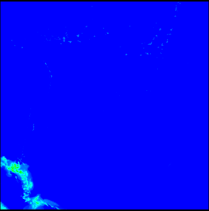

# ETOPO2v2標高グリッドデータ

1. http://www.ngdc.noaa.gov/mgg/global/relief/ETOPO2/ETOPO2v2-2006/ETOPO2v2c/45\_deg\_squares/LSB/ から標高データをダウンロードして解凍．  
例) 45N135E.bin.gz: 左上座標が北緯45度東経135度
2. build用ディレクトリを作成
3. cmake
4. make
5. etopo2 <ファイル名>
